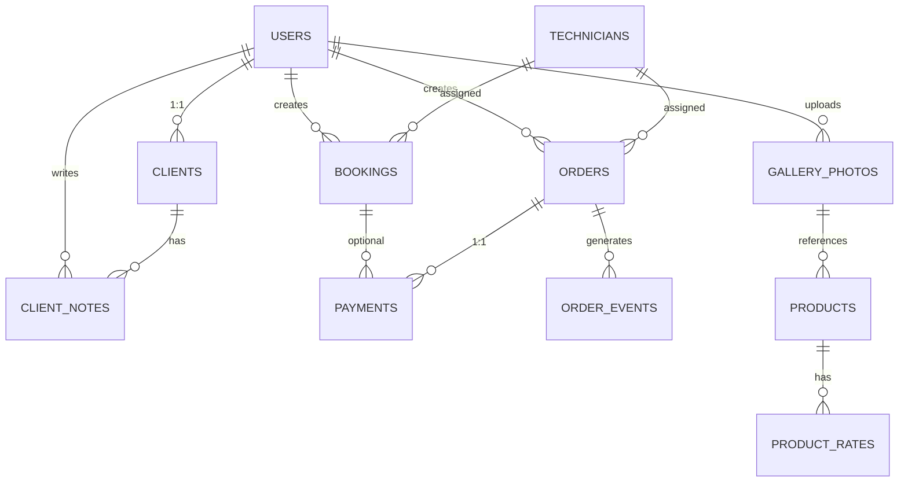

# Theolan Aluminium International Ltd — System Architecture

**Version:** 1.0  
**Date:** 2024  
**Author:** Full-Stack Engineering Team  
**Status:** Ready for Development

---

## Executive Summary

Theolan's web platform is a **three-tier, scalable application** serving two distinct user personas (clients & admins) with a shared backend API. The architecture prioritizes **security**, **performance**, and **operational visibility** across booking, order management, payment processing, and client engagement.

**Tech Stack (Confirmed):**
- **Frontend:** React.js (Hooks, Context API), Tailwind CSS, Vite, React Query
- **Backend:** Node.js + Express.js, REST API (12+ endpoints)
- **Database:** PostgreSQL (relational, ACID-compliant)
- **Auth:** JWT (stateless, refresh tokens)
- **Payments:** Safaricom Daraja API (M-Pesa STK Push)
- **Notifications:** Africa's Talking (SMS/WhatsApp)
- **File Storage:** Cloudinary (gallery images)
- **Hosting:** Vercel (frontend), Railway/AWS (backend), PostgreSQL managed DB

---

## Architecture Layers

### 1. Presentation Layer (Frontend)

**Responsibilities:**
- Render UI for clients (public pages, booking, quote, gallery, account dashboard, order tracking)
- Render UI for admins (order management, CRM, booking calendar, gallery manager, analytics)
- Form validation (Zod schemas, React Hook Form)
- State management (Context API + React Query for server state)
- Client-side authentication (JWT token storage, refresh logic)

**Key Frameworks:**
- `React.js` — component-driven architecture
- `Tailwind CSS` — utility-first styling matching brand palette (charcoal, cobalt, gold, silver)
- `Vite` — fast build tooling
- `React Query` — server state synchronization (orders, bookings, products)
- `React Hook Form` — performant form handling (booking, signup, filters)
- `Zod` — runtime schema validation (prevents invalid submission)
- `React Router v6` — client-side routing (/home, /booking, /quote, /products, /account, /orders, /admin/*)

**State Management Pattern:**
```
Context API (global: auth, user profile, client theme)
├── AuthContext (currentUser, JWT, refresh token)
├── UserContext (profile, saved addresses, preferences)
└── ThemeContext (light/dark, mobile detection)

React Query (server state)
├── useQuery('orders') — fetch client's orders
├── useQuery('bookings') — fetch client's booked visits
├── useQuery('products') — fetch product catalogue
├── useMutation('submitBooking') — create booking
└── useMutation('updateOrder') — admin updates order status
```

**Entry Points:**
- `/src/main.jsx` — app root
- `/src/pages/` — public pages (Home, Booking, Quote, Products, Gallery, Account, Orders, etc.)
- `/src/components/` — reusable UI components (Button, Form, Card, Table, Modal, etc.)
- `/src/services/api.js` — centralized API client (axios instance, interceptors for JWT)
- `/src/hooks/` — custom React hooks (useAuth, useOrders, useBookings, etc.)

---

### 2. API Layer (Backend)

**Responsibilities:**
- Handle HTTP requests from frontend
- Implement business logic (booking validation, quote calculation, order state transitions)
- Authenticate requests (JWT verification)
- Authorize actions (role-based: client vs. admin)
- Interact with database
- Call external services (M-Pesa, Africa's Talking, Cloudinary)
- Return standardized JSON responses

**Framework:** Node.js + Express.js

**Architecture Pattern:** **MVC-style with middleware stack**

```
Request Flow:
1. HTTP Request arrives at Express router
2. Middleware chain (auth, logging, error handling)
3. Route handler (controller) processes business logic
4. DAO/Service layer queries database
5. Response formatted + returned
6. Response sent to client
```

**Middleware Stack (Global):**
```javascript
app.use(express.json()); // Body parser
app.use(cors()); // Enable cross-origin requests (Vercel frontend → Railway backend)
app.use(logger); // Request logging (Morgan or custom)
app.use(authMiddleware); // JWT verification (except /auth routes)
app.use(errorHandler); // Centralized error handling
```

**Route Structure:**

```
/api/v1/
├── /auth (POST /login, POST /signup, POST /otp-verify, POST /refresh-token, POST /forgot-password)
├── /bookings (GET, POST, PATCH)
├── /orders (GET, PATCH — client views own; admin views all)
├── /products (GET — public catalogue)
├── /quote (POST — calculate instant estimate)
├── /gallery (GET — public photos; POST/DELETE — admin manage)
├── /clients (GET, POST, PATCH — admin CRM)
├── /technicians (GET, PATCH — admin assign visits)
├── /payments (POST /webhook — M-Pesa callback)
├── /admin/analytics (GET — revenue, visit stats)
└── /admin/invoices (POST — generate PDF quotation)
```

**Request/Response Pattern:**

```javascript
// Success Response (200, 201, 204)
{
  "success": true,
  "data": { /* actual data */ },
  "message": "Order updated successfully"
}

// Error Response (400, 401, 403, 500)
{
  "success": false,
  "error": "VALIDATION_ERROR",
  "message": "Email already registered",
  "details": { field: "email", value: "user@example.com" }
}
```

**Key Services:**

1. **AuthService**
   - Generate JWT + refresh token
   - Verify OTP against `otp_codes` table
   - Hash password (bcrypt)
   - Handle token refresh, logout

2. **BookingService**
   - Validate availability (check `time_slots` table)
   - Create booking record
   - Send SMS confirmation (Africa's Talking)
   - Assign technician if available

3. **OrderService**
   - Transition order states (quoted → confirmed → fabrication → ready → installed)
   - Append timeline events
   - Calculate delivery ETA
   - Prepare invoice/quotation

4. **QuoteService**
   - Fetch base rates from `product_rates` table
   - Calculate area (m²) from dimensions
   - Apply finish multipliers
   - Return estimate range (±8-10%)

5. **GalleryService**
   - Upload photos to Cloudinary
   - Tag by category/finish
   - Toggle published/draft status
   - Return filtered gallery

6. **PaymentService**
   - Handle M-Pesa STK Push initiator
   - Process callback webhooks from Safaricom
   - Update payment status in `orders` table
   - Log transaction for audit trail

7. **NotificationService**
   - Send SMS via Africa's Talking (booking confirmation, order updates)
   - Send WhatsApp messages (optional, future phase)
   - Send email via SendGrid (quotations, receipts)

---

### 3. Data Layer (Database)

**Database:** PostgreSQL (relational, ACID-compliant, indexes for performance)

**Core Tables:**

```
users
├── id (UUID PK)
├── phone (VARCHAR, unique, +254...)
├── email (VARCHAR, nullable, unique)
├── name (VARCHAR)
├── password_hash (VARCHAR, bcrypt)
├── phone_verified_at (TIMESTAMP, nullable)
├── created_at (TIMESTAMP)
└── role (ENUM: 'client', 'admin') — added for authorization

bookings
├── id (UUID PK)
├── client_id (FK → users)
├── service_type (ENUM: 'windows', 'doors', 'curtain_wall', 'partitions', 'balustrades')
├── property_type (ENUM: 'residential', 'commercial')
├── location (VARCHAR)
├── scheduled_at (TIMESTAMP)
├── contact_method (ENUM: 'sms', 'whatsapp', 'email')
├── notes (TEXT, nullable)
├── status (ENUM: 'scheduled', 'completed', 'cancelled')
├── assigned_technician_id (FK → technicians, nullable)
├── created_at (TIMESTAMP)
├── INDEX (client_id, scheduled_at)
└── INDEX (status, scheduled_at)

orders
├── id (UUID PK)
├── client_id (FK → users)
├── product_summary (VARCHAR, e.g., "3x Sliding Doors, Black Finish")
├── dimensions_notes (TEXT, nullable, e.g., "W2m × H2.5m")
├── status (ENUM: 'quoted', 'confirmed', 'fabrication', 'ready', 'installed')
├── total_price_kes (NUMERIC, 2 decimals)
├── paid_amount_kes (NUMERIC, 2 decimals, default 0)
├── payment_status (ENUM: 'unpaid', 'deposit_received', 'paid_in_full')
├── scheduled_installation_at (TIMESTAMP, nullable)
├── assigned_technician_id (FK → technicians, nullable)
├── created_at (TIMESTAMP)
├── updated_at (TIMESTAMP)
├── INDEX (client_id, status)
├── INDEX (assigned_technician_id)
└── INDEX (payment_status)

order_events (timeline)
├── id (UUID PK)
├── order_id (FK → orders)
├── title (VARCHAR, e.g., "Deposit received", "Fabrication started")
├── description (TEXT, nullable, e.g., "Glass unit arrived from supplier")
├── occurred_at (TIMESTAMP)
├── created_at (TIMESTAMP)
└── INDEX (order_id, occurred_at)

products (catalogue)
├── id (UUID PK)
├── name (VARCHAR, e.g., "Fixed Window — Single Pane")
├── category (ENUM: 'windows', 'doors', 'curtain_walls', 'partitions', 'balustrades')
├── finish (ENUM: 'mill', 'silver', 'black', 'champagne', 'bronze')
├── description (TEXT)
├── base_price_per_sqm_kes (NUMERIC)
├── image_url (VARCHAR, Cloudinary URL)
├── published (BOOLEAN, default true)
├── created_at (TIMESTAMP)
└── INDEX (category, finish)

product_rates (pricing table for quote calculator)
├── id (UUID PK)
├── product_id (FK → products)
├── base_rate_per_sqm_kes (NUMERIC)
├── double_glazing_multiplier (NUMERIC, default 1.35)
├── finish_multiplier (NUMERIC, varies by finish)
├── updated_at (TIMESTAMP)
└── INDEX (product_id)

gallery_photos (project photos)
├── id (UUID PK)
├── category (ENUM: 'windows', 'doors', 'curtain_walls', 'partitions', 'balustrades')
├── finish (ENUM: 'mill', 'silver', 'black', 'champagne', 'bronze', nullable)
├── project_name (VARCHAR, nullable)
├── image_url (VARCHAR, Cloudinary URL)
├── published (BOOLEAN, default false)
├── uploaded_by (FK → users, admin)
├── created_at (TIMESTAMP)
└── INDEX (category, published)

clients (CRM records)
├── id (UUID PK)
├── user_id (FK → users, unique)
├── status (ENUM: 'lead', 'active', 'repeat') — computed from orders count
├── lifetime_value_kes (NUMERIC, 2 decimals, auto-calculated)
├── last_contact_at (TIMESTAMP)
├── order_count (INT, auto-calculated)
├── created_at (TIMESTAMP)
└── INDEX (status, last_contact_at)

client_notes (CRM notes)
├── id (UUID PK)
├── client_id (FK → clients)
├── note_text (TEXT)
├── created_by (FK → users, admin)
├── created_at (TIMESTAMP)
└── INDEX (client_id, created_at)

technicians (field team)
├── id (UUID PK)
├── name (VARCHAR)
├── phone (VARCHAR)
├── email (VARCHAR)
├── color_code (VARCHAR, hex color for calendar UI, e.g., "#0055CC")
├── status (ENUM: 'active', 'inactive')
├── created_at (TIMESTAMP)
└── INDEX (status)

time_slots (availability for booking form)
├── id (UUID PK)
├── date (DATE)
├── start_time (TIME)
├── end_time (TIME)
├── available (BOOLEAN, default true)
├── created_at (TIMESTAMP)
└── INDEX (date, available)

payments (transaction log)
├── id (UUID PK)
├── order_id (FK → orders, nullable)
├── booking_id (FK → bookings, nullable)
├── amount_kes (NUMERIC)
├── method (ENUM: 'mpesa', 'bank_transfer')
├── mpesa_receipt (VARCHAR, nullable, e.g., "LHD1AS2KK3")
├── status (ENUM: 'pending', 'success', 'failed')
├── created_at (TIMESTAMP)
└── INDEX (order_id, status)

otp_codes (short-lived)
├── id (UUID PK)
├── phone (VARCHAR)
├── code (VARCHAR, 4-6 digits)
├── expires_at (TIMESTAMP)
├── verified_at (TIMESTAMP, nullable)
├── created_at (TIMESTAMP)
└── INDEX (phone, expires_at)
```

**ER Diagram (Mermaid):**



**Indexes (Performance):**
- `users(phone, email)` — fast auth lookup
- `bookings(client_id, scheduled_at)` — client's upcoming visits
- `bookings(status, scheduled_at)` — calendar filtering
- `orders(client_id, status)` — client's order history
- `orders(assigned_technician_id)` — technician's workload
- `orders(payment_status)` — finance dashboard
- `order_events(order_id, occurred_at)` — timeline display
- `products(category, finish)` — catalogue filtering
- `gallery_photos(category, published)` — gallery display
- `clients(status, last_contact_at)` — CRM sorting
- `time_slots(date, available)` — booking form availability

---

## Authentication & Authorization Flow

### JWT-Based Stateless Auth

**Flow:**

```
1. Client POST /api/v1/auth/login
   ├── Input: phone, password (or email, password)
   ├── Validate credentials against users.password_hash (bcrypt)
   ├── Generate JWT (exp: 15 min) + Refresh Token (exp: 7 days)
   ├── Return { access_token, refresh_token, user { id, name, phone, role } }

2. Client stores tokens
   ├── access_token → localStorage (or secure httpOnly cookie, preferred)
   ├── refresh_token → localStorage

3. Client includes Authorization header in API requests
   ├── Authorization: Bearer <access_token>

4. Backend middleware validates JWT
   ├── Decode token, verify signature
   ├── Check expiration, set req.user = decoded payload
   ├── If expired, reject with 401 Unauthorized

5. Client receives 401, calls POST /api/v1/auth/refresh-token
   ├── Send refresh_token
   ├── Backend validates, generates new access_token
   ├── Client retries original request with new token

6. Client logout
   ├── DELETE /api/v1/auth/logout (invalidate refresh_token server-side)
   ├── Clear localStorage tokens
```

**JWT Payload (access_token):**
```json
{
  "sub": "user-id-uuid",
  "phone": "+254712345678",
  "name": "John Doe",
  "role": "client",
  "iat": 1704067200,
  "exp": 1704068100
}
```

**Refresh Token:** Stored in database (or Redis) with expiry for revocation support.

### Role-Based Authorization

**Roles:**
- `client` — Can view own bookings, orders, profile. Cannot access admin routes.
- `admin` — Can view/edit all orders, clients, technicians, gallery, bookings calendar.

**Middleware Check:**
```javascript
function authorize(roles = []) {
  return (req, res, next) => {
    if (!roles.includes(req.user.role)) {
      return res.status(403).json({ error: 'FORBIDDEN' });
    }
    next();
  };
}

// Usage
router.get('/admin/orders', authorize(['admin']), getOrders);
```

---

## Payment Processing (M-Pesa)

### Flow: STK Push (USSD-triggered payment)

**Trigger:** Client confirms booking or order deposit.

**Steps:**

```
1. Client clicks "Pay Deposit" on booking confirmation
   ├── Frontend POST /api/v1/payments/initiate-stk
   ├── Payload: { booking_id or order_id, amount_kes }

2. Backend initiates M-Pesa STK Push
   ├── Call Safaricom Daraja API (BusinessRegisterUrl)
   ├── User receives USSD popup on phone
   ├── User enters M-Pesa PIN

3. Safaricom sends callback to configured webhook
   ├── POST /api/v1/payments/mpesa-callback
   ├── Payload includes: CheckoutRequestID, ResultCode, Amount, MpesaReceiptNumber

4. Backend processes callback
   ├── Verify signature (Safaricom API key)
   ├── If ResultCode == 0 (success):
   │  ├── Create payment record
   │  ├── Update order.payment_status = 'deposit_received'
   │  ├── Append order_event (timeline)
   │  ├── Send SMS confirmation via Africa's Talking
   │  └── Return { ResultCode: 0 }
   └── Else (failed):
      ├── Return { ResultCode: error_code }

5. Client receives SMS confirmation
   ├── Message: "Ksh 5,000 payment received for Order #ORD001. Fabrication begins next week."
```

**Implementation Notes:**
- Webhook must be publicly accessible (not localhost)
- Callback verification includes signature validation (HMAC)
- Idempotency: process same callback only once (check ResultCode in payments table)
- Timeout: if callback not received within 30 min, show manual payment entry form

---

## Notification Flow (Africa's Talking)

### SMS Notifications

**Triggers:**

1. **Booking Confirmation**
   ```
   Message: "Site visit confirmed for Wed, 15 Jan at 2:30 PM. 
            Ref: BKG001. Reply CONFIRM or CANCEL."
   Recipient: booking.client.phone
   ```

2. **Order Status Update**
   ```
   Message: "Your order ORD001 has moved to Fabrication stage. 
            Expected ready: 22 Jan 2024."
   Recipient: order.client.phone
   ```

3. **Payment Received**
   ```
   Message: "Ksh 5,000 deposit received for Order ORD001. 
            Fabrication begins tomorrow."
   Recipient: order.client.phone
   ```

4. **Installation Scheduled**
   ```
   Message: "Installation scheduled for Fri, 22 Jan at 9:00 AM. 
            Technician: Kevin. Contact: 0712345678."
   Recipient: order.client.phone
   ```

**Implementation:**
```javascript
const africaTalking = require('africastalking')({
  apiKey: process.env.AFRICASTALKING_API_KEY,
  username: 'sandbox' // or production account
});

async function sendSMS(phone, message) {
  try {
    const result = await africaTalking.SMS.send({
      to: [phone],
      message: message
    });
    return result;
  } catch (error) {
    console.error('SMS failed:', error);
    // Log to database for retry
  }
}
```

---

## Error Handling Strategy

**Standardized Error Responses:**

```javascript
// BadRequest (400)
{
  "success": false,
  "error": "VALIDATION_ERROR",
  "message": "Email must be valid",
  "details": { "field": "email" }
}

// Unauthorized (401)
{
  "success": false,
  "error": "UNAUTHORIZED",
  "message": "Invalid credentials"
}

// Forbidden (403)
{
  "success": false,
  "error": "FORBIDDEN",
  "message": "Admins only"
}

// NotFound (404)
{
  "success": false,
  "error": "NOT_FOUND",
  "message": "Order not found"
}

// Conflict (409)
{
  "success": false,
  "error": "CONFLICT",
  "message": "Email already registered"
}

// InternalServerError (500)
{
  "success": false,
  "error": "INTERNAL_ERROR",
  "message": "An unexpected error occurred. Reference: ERROR_abc123"
}
```

**Error Handling Middleware:**

```javascript
app.use((err, req, res, next) => {
  const status = err.status || 500;
  const error = err.code || 'INTERNAL_ERROR';
  const message = err.message || 'An unexpected error occurred';
  
  res.status(status).json({
    success: false,
    error,
    message,
    ...(process.env.NODE_ENV === 'development' && { stack: err.stack })
  });
});
```

---

## Performance & Caching Strategy

### Query Optimization

**N+1 Query Prevention:**
- Use JOINs for related data (orders + order_events in single query)
- Use SELECT specific columns (not `SELECT *`)
- Batch load technician data (one query, not per-order)

**Example (Good):**
```sql
SELECT o.id, o.product_summary, o.status, o.total_price_kes,
       t.name, t.phone,
       COUNT(oe.id) as event_count
FROM orders o
LEFT JOIN technicians t ON o.assigned_technician_id = t.id
LEFT JOIN order_events oe ON o.id = oe.order_id
WHERE o.client_id = $1
GROUP BY o.id, t.id;
```

### Caching Layer (Future Phase 2)

**Candidates for Redis caching:**
- Product catalogue (read-heavy, changes rarely)
- Time slots availability (accessed on every booking form load)
- Technician schedules (admin calendar)
- Gallery photos (filtered by category/finish)

**TTL Strategy:**
- Products: 24 hours (invalidate on admin edit)
- Slots: 1 hour (or invalidate on booking)
- Gallery: 6 hours
- User session: 7 days (JWT refresh token expiry)

---

## Deployment Architecture

```
┌─────────────────────────────────────────────────────────────┐
│                        Internet                              │
└──────────────────────┬──────────────────────────────────────┘
                       │
        ┌──────────────┴──────────────┐
        │                             │
   ┌────▼──────────┐          ┌──────▼─────────┐
   │ Vercel (CDN)  │          │   Cloudflare   │
   │ React App     │          │   DNS + DDoS   │
   │ olanallumint  │          │   Protection   │
   │ .co.ke        │          │                │
   └────┬──────────┘          └────────────────┘
        │
        │ API calls
        │ (JSON, CORS)
        │
   ┌────▼────────────────────────────────────┐
   │   Railway.app or AWS EC2 (Backend)       │
   │   Node.js + Express.js                   │
   │   Ports: 3000 (API), 8080 (health)      │
   │   Environment: .env (secrets excluded)   │
   └────┬────────────────────────────────────┘
        │
        ├── PostgreSQL (Managed RDS or Railway)
        │   ├── Host: db.railway.app:5432
        │   ├── Database: theolan_prod
        │   └── Backup: daily snapshots
        │
        ├── Cloudinary (File Storage)
        │   ├── API Key: stored in .env
        │   └── Upload endpoint: https://api.cloudinary.com
        │
        ├── Safaricom Daraja (M-Pesa)
        │   ├── Consumer Key: in .env
        │   ├── Webhook: /api/v1/payments/mpesa-callback
        │   └── IP Whitelisting: configure on Safaricom dashboard
        │
        └── Africa's Talking (SMS)
            ├── API Key: in .env
            └── Endpoint: https://api.sandbox.africastalking.com (or production)
```

**Environment Variables (Backend .env):**
```
NODE_ENV=production
PORT=3000

DB_HOST=db.railway.app
DB_PORT=5432
DB_NAME=theolan_prod
DB_USER=postgres
DB_PASSWORD=***

JWT_SECRET=***
JWT_REFRESH_SECRET=***

CLOUDINARY_NAME=***
CLOUDINARY_KEY=***
CLOUDINARY_SECRET=***

SAFARICOM_CONSUMER_KEY=***
SAFARICOM_CONSUMER_SECRET=***
SAFARICOM_SHORTCODE=123456
SAFARICOM_PASSKEY=***

AFRICASTALKING_API_KEY=***
AFRICASTALKING_USERNAME=Theolan

SENDGRID_API_KEY=***
SENDGRID_FROM_EMAIL=noreply@olanallumint.co.ke

FRONTEND_URL=https://olanallumint.co.ke
```

---

## Monitoring & Observability

### Logging

**Tools:** Winston (Node.js) + ELK or Papertrail

**Log Levels:**
- `error`: Database failures, payment errors, auth failures
- `warn`: Rate limit exceeded, slow queries (>1s)
- `info`: API requests, order state transitions, SMS sent
- `debug`: Request/response bodies (development only)

**Example:**
```javascript
logger.info('Order transitioned', {
  orderId: order.id,
  from: 'quoted',
  to: 'confirmed',
  timestamp: new Date().toISOString()
});
```

### Metrics

**Tools:** Prometheus + Grafana or Datadog

**Key Metrics:**
- API response time (p50, p95, p99)
- Error rate (5xx, 4xx by endpoint)
- Database query performance (slow query log)
- M-Pesa callback latency
- SMS delivery rate
- Active users (concurrent sessions)

### Alerts

**Configured Alerts:**
- Payment callback failure (instant)
- API error rate > 1% (5 min window)
- Database connection pool exhausted
- SMS delivery failures > 5%
- Disk space > 80%

---

## Security Considerations

### HTTPS/TLS

- All API endpoints served over HTTPS (enforced by Vercel/Railway)
- HSTS header: `Strict-Transport-Security: max-age=31536000`

### Input Validation

- Zod schemas on frontend + backend (never trust client)
- Phone number format: regex `^\+254[0-9]{9}$`
- Email: standard RFC 5322 regex
- Dimensions: numeric range (0.5m to 10m)
- SQL injection prevention: parameterized queries (pg library)

### CSRF Protection

- CORS restricted to frontend domain (`https://olanallumint.co.ke`)
- SameSite cookie attribute: `SameSite=Strict`
- State tokens for sensitive operations (future phase)

### Secrets Management

- All API keys, passwords in `.env` (never committed to git)
- Rotate M-Pesa/Africa's Talking keys quarterly
- Database credentials rotated on security incident
- .gitignore includes `.env`, `.env.local`

---

## Next Steps

1. **Backend Setup:** Initialize Express app, database migrations, JWT middleware, external API clients
2. **Frontend Setup:** Create React app structure, context providers, API service layer, form validation schemas
3. **Database Migrations:** Create tables and indexes (Knex.js or TypeORM)
4. **API Development:** Implement all 12+ endpoints (auth, bookings, orders, products, payments, admin)
5. **Integration Testing:** Test auth flow, booking → order → payment pipeline, SMS notifications
6. **Deployment:** Configure Vercel (frontend), Railway/AWS (backend), PostgreSQL, M-Pesa sandbox testing
7. **Performance Testing:** Load test booking form, quote calculator with k6 or Apache JMeter

---

**Status:** Ready for development team to begin backend + frontend implementation in parallel.
