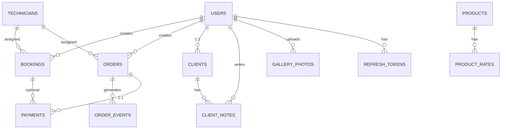

# Database Schema — Theolan Aluminium International Ltd

**Version:** 1.0  
**Database:** PostgreSQL 14+  
**Status:** Ready for Migration

---

## Overview

PostgreSQL relational schema with 12 core tables, designed for ACID compliance, referential integrity, and query performance via strategic indexing.

---

## Table Definitions

### 1. users (Authentication & Identity)

```sql
CREATE TABLE users (
  id UUID PRIMARY KEY DEFAULT gen_random_uuid(),
  phone VARCHAR(20) NOT NULL UNIQUE,
  email VARCHAR(255) UNIQUE,
  name VARCHAR(255) NOT NULL,
  password_hash VARCHAR(255) NOT NULL,
  role VARCHAR(50) NOT NULL DEFAULT 'client' CHECK (role IN ('client', 'admin')),
  phone_verified_at TIMESTAMP,
  created_at TIMESTAMP NOT NULL DEFAULT CURRENT_TIMESTAMP,
  updated_at TIMESTAMP DEFAULT CURRENT_TIMESTAMP,
  
  -- Indexes
  CONSTRAINT phone_format CHECK (phone ~ '^\+254[0-9]{9}$')
);

CREATE INDEX idx_users_phone ON users(phone);
CREATE INDEX idx_users_email ON users(email);
CREATE INDEX idx_users_role ON users(role);
CREATE INDEX idx_users_created_at ON users(created_at DESC);
```

**Purpose:** Central identity table for both clients and admin staff.

**Fields:**
- `phone`: Unique identifier (Kenyan format +254...)
- `email`: Optional secondary contact
- `role`: Authorization level (client or admin)
- `password_hash`: bcrypt hash (never store plaintext)
- `phone_verified_at`: Timestamp when OTP verified (null = unverified)

---

### 2. otp_codes (Short-Lived Verification)

```sql
CREATE TABLE otp_codes (
  id UUID PRIMARY KEY DEFAULT gen_random_uuid(),
  phone VARCHAR(20) NOT NULL,
  code VARCHAR(10) NOT NULL,
  expires_at TIMESTAMP NOT NULL,
  verified_at TIMESTAMP,
  attempts INT DEFAULT 0,
  created_at TIMESTAMP NOT NULL DEFAULT CURRENT_TIMESTAMP,
  
  CONSTRAINT code_format CHECK (code ~ '^[0-9]{4,6}$')
);

CREATE INDEX idx_otp_codes_phone_expires ON otp_codes(phone, expires_at DESC);
CREATE INDEX idx_otp_codes_verified ON otp_codes(verified_at);
```

**Purpose:** Time-limited one-time passwords for signup/password reset verification.

**Lifecycle:**
- Client signs up → code generated with 10-min expiry
- Client enters code → verified_at set, code invalidated
- Expired codes cleaned up nightly (VACUUM job)

**TTL:** 10 minutes (configurable)

---

### 3. refresh_tokens (Session Management)

```sql
CREATE TABLE refresh_tokens (
  id UUID PRIMARY KEY DEFAULT gen_random_uuid(),
  user_id UUID NOT NULL REFERENCES users(id) ON DELETE CASCADE,
  token VARCHAR(500) NOT NULL UNIQUE,
  expires_at TIMESTAMP NOT NULL,
  revoked_at TIMESTAMP,
  created_at TIMESTAMP NOT NULL DEFAULT CURRENT_TIMESTAMP,
  
  CONSTRAINT token_length CHECK (LENGTH(token) > 100)
);

CREATE INDEX idx_refresh_tokens_user_id ON refresh_tokens(user_id);
CREATE INDEX idx_refresh_tokens_token ON refresh_tokens(token);
CREATE INDEX idx_refresh_tokens_expires_at ON refresh_tokens(expires_at DESC);
```

**Purpose:** Long-lived tokens for generating new access tokens without re-login.

**Rotation:** Clients keep one active token; new login revokes old tokens.

---

### 4. clients (CRM Records)

```sql
CREATE TABLE clients (
  id UUID PRIMARY KEY DEFAULT gen_random_uuid(),
  user_id UUID NOT NULL UNIQUE REFERENCES users(id) ON DELETE CASCADE,
  status VARCHAR(50) NOT NULL DEFAULT 'lead' CHECK (status IN ('lead', 'active', 'repeat')),
  lifetime_value_kes NUMERIC(12, 2) DEFAULT 0,
  last_contact_at TIMESTAMP,
  order_count INT DEFAULT 0,
  created_at TIMESTAMP NOT NULL DEFAULT CURRENT_TIMESTAMP,
  updated_at TIMESTAMP DEFAULT CURRENT_TIMESTAMP
);

CREATE INDEX idx_clients_status ON clients(status);
CREATE INDEX idx_clients_last_contact_at ON clients(last_contact_at DESC);
CREATE INDEX idx_clients_lifetime_value_kes ON clients(lifetime_value_kes DESC);
```

**Purpose:** Denormalized CRM table for client relationship tracking.

**Status Computation (trigger/query logic):**
- `lead`: user has 0 orders
- `active`: user has exactly 1 order (current engagement)
- `repeat`: user has > 1 orders (valuable relationship)

---

### 5. client_notes (CRM History)

```sql
CREATE TABLE client_notes (
  id UUID PRIMARY KEY DEFAULT gen_random_uuid(),
  client_id UUID NOT NULL REFERENCES clients(id) ON DELETE CASCADE,
  note_text TEXT NOT NULL,
  created_by UUID NOT NULL REFERENCES users(id),
  created_at TIMESTAMP NOT NULL DEFAULT CURRENT_TIMESTAMP
);

CREATE INDEX idx_client_notes_client_id ON client_notes(client_id, created_at DESC);
```

**Purpose:** Free-form notes attached to client records (e.g., "prefers SMS", "commercial account", "payment history: good").

**Accumulation:** Notes never deleted, only added, preserving institutional memory.

---

### 6. bookings (Site Visit Scheduling)

```sql
CREATE TABLE bookings (
  id UUID PRIMARY KEY DEFAULT gen_random_uuid(),
  client_id UUID NOT NULL REFERENCES users(id) ON DELETE CASCADE,
  service_type VARCHAR(100) NOT NULL CHECK (service_type IN ('windows', 'doors', 'curtain_wall', 'partitions', 'balustrades', 'glazing')),
  property_type VARCHAR(100) CHECK (property_type IN ('residential', 'commercial')),
  location VARCHAR(255) NOT NULL,
  notes TEXT,
  scheduled_at TIMESTAMP NOT NULL,
  contact_method VARCHAR(50) CHECK (contact_method IN ('sms', 'whatsapp', 'email')),
  assigned_technician_id UUID REFERENCES technicians(id),
  status VARCHAR(50) NOT NULL DEFAULT 'scheduled' CHECK (status IN ('scheduled', 'completed', 'cancelled', 'no_show')),
  created_at TIMESTAMP NOT NULL DEFAULT CURRENT_TIMESTAMP,
  updated_at TIMESTAMP DEFAULT CURRENT_TIMESTAMP
);

CREATE INDEX idx_bookings_client_id_scheduled ON bookings(client_id, scheduled_at DESC);
CREATE INDEX idx_bookings_status_scheduled ON bookings(status, scheduled_at DESC);
CREATE INDEX idx_bookings_assigned_technician ON bookings(assigned_technician_id, scheduled_at);
CREATE INDEX idx_bookings_scheduled_at ON bookings(scheduled_at DESC);
```

**Purpose:** Free site visits booked by clients via online form.

**Lifecycle:**
1. Client fills booking form → record created with `scheduled` status
2. Admin assigns technician → `assigned_technician_id` populated
3. Technician completes visit → status = `completed`
4. If client cancels → status = `cancelled`

---

### 7. orders (Fabrication Projects)

```sql
CREATE TABLE orders (
  id UUID PRIMARY KEY DEFAULT gen_random_uuid(),
  client_id UUID NOT NULL REFERENCES users(id) ON DELETE RESTRICT,
  product_summary VARCHAR(500) NOT NULL,
  dimensions_notes TEXT,
  status VARCHAR(50) NOT NULL DEFAULT 'quoted' CHECK (status IN ('quoted', 'confirmed', 'fabrication', 'ready', 'installed')),
  total_price_kes NUMERIC(12, 2) NOT NULL,
  paid_amount_kes NUMERIC(12, 2) DEFAULT 0,
  payment_status VARCHAR(50) NOT NULL DEFAULT 'unpaid' CHECK (payment_status IN ('unpaid', 'deposit_received', 'paid_in_full')),
  scheduled_installation_at TIMESTAMP,
  assigned_technician_id UUID REFERENCES technicians(id),
  created_at TIMESTAMP NOT NULL DEFAULT CURRENT_TIMESTAMP,
  updated_at TIMESTAMP DEFAULT CURRENT_TIMESTAMP,
  
  CONSTRAINT price_positive CHECK (total_price_kes > 0),
  CONSTRAINT paid_le_total CHECK (paid_amount_kes <= total_price_kes)
);

CREATE INDEX idx_orders_client_id_status ON orders(client_id, status);
CREATE INDEX idx_orders_status ON orders(status);
CREATE INDEX idx_orders_payment_status ON orders(payment_status);
CREATE INDEX idx_orders_assigned_technician ON orders(assigned_technician_id);
CREATE INDEX idx_orders_created_at ON orders(created_at DESC);
```

**Purpose:** Fabrication projects with pricing, payment tracking, and installation scheduling.

**State Machine:**
```
  quoted → confirmed → fabrication → ready → installed
    ↓                                           ↑
    └─────────────────────────────────────────┘
              (if rejected, loop back)
```

---

### 8. order_events (Timeline/Audit Trail)

```sql
CREATE TABLE order_events (
  id UUID PRIMARY KEY DEFAULT gen_random_uuid(),
  order_id UUID NOT NULL REFERENCES orders(id) ON DELETE CASCADE,
  title VARCHAR(255) NOT NULL,
  description TEXT,
  occurred_at TIMESTAMP NOT NULL,
  is_current BOOLEAN DEFAULT false,
  created_at TIMESTAMP NOT NULL DEFAULT CURRENT_TIMESTAMP
);

CREATE INDEX idx_order_events_order_id_occurred ON order_events(order_id, occurred_at DESC);
CREATE INDEX idx_order_events_is_current ON order_events(is_current);
```

**Purpose:** Immutable timeline of order progress (deposit received, fabrication started, glass arrived, etc.).

**Client View:** Timeline displayed in order tracking dashboard (builds trust).

**Admin View:** Admins append events as work progresses.

**Example Events:**
```
- "Deposit received: KES 5,000"
- "Fabrication started"
- "Glass unit arrived from supplier"
- "Ready for installation"
- "Installation completed"
```

---

### 9. technicians (Field Team)

```sql
CREATE TABLE technicians (
  id UUID PRIMARY KEY DEFAULT gen_random_uuid(),
  name VARCHAR(255) NOT NULL,
  phone VARCHAR(20) NOT NULL UNIQUE,
  email VARCHAR(255),
  color_code VARCHAR(7) NOT NULL DEFAULT '#0055CC',
  status VARCHAR(50) NOT NULL DEFAULT 'active' CHECK (status IN ('active', 'inactive')),
  created_at TIMESTAMP NOT NULL DEFAULT CURRENT_TIMESTAMP,
  updated_at TIMESTAMP DEFAULT CURRENT_TIMESTAMP,
  
  CONSTRAINT phone_format CHECK (phone ~ '^\+254[0-9]{9}$'),
  CONSTRAINT color_format CHECK (color_code ~ '^#[0-9A-F]{6}$')
);

CREATE INDEX idx_technicians_status ON technicians(status);
```

**Purpose:** Roster of installation/site visit technicians.

**color_code:** Used in booking calendar UI for visual filtering (e.g., Kevin = blue, Brian = green, James = amber).

---

### 10. time_slots (Availability Management)

```sql
CREATE TABLE time_slots (
  id UUID PRIMARY KEY DEFAULT gen_random_uuid(),
  date DATE NOT NULL,
  start_time TIME NOT NULL,
  end_time TIME NOT NULL,
  available BOOLEAN DEFAULT true,
  created_at TIMESTAMP NOT NULL DEFAULT CURRENT_TIMESTAMP,
  updated_at TIMESTAMP DEFAULT CURRENT_TIMESTAMP,
  
  CONSTRAINT time_order CHECK (start_time < end_time)
);

CREATE INDEX idx_time_slots_date_available ON time_slots(date, available);
CREATE UNIQUE INDEX idx_time_slots_unique_slot ON time_slots(date, start_time, end_time);
```

**Purpose:** Seed slots for booking form (e.g., Mon-Fri 9am-5pm in 30-min intervals).

**Admin Control:** Admins can toggle `available = false` to block out holidays, training, etc.

**Lifecycle:**
- Slots pre-generated monthly for next 3 months
- Booking form queries available slots
- When client books → corresponding slot marked unavailable (soft-delete pattern)

---

### 11. products (Catalogue)

```sql
CREATE TABLE products (
  id UUID PRIMARY KEY DEFAULT gen_random_uuid(),
  name VARCHAR(255) NOT NULL,
  category VARCHAR(100) NOT NULL CHECK (category IN ('windows', 'doors', 'curtain_walls', 'partitions', 'balustrades')),
  finish VARCHAR(100) NOT NULL CHECK (finish IN ('mill', 'silver', 'black', 'champagne', 'bronze')),
  description TEXT,
  base_price_per_sqm_kes NUMERIC(10, 2) NOT NULL,
  image_url VARCHAR(500),
  published BOOLEAN DEFAULT true,
  created_at TIMESTAMP NOT NULL DEFAULT CURRENT_TIMESTAMP,
  updated_at TIMESTAMP DEFAULT CURRENT_TIMESTAMP,
  
  CONSTRAINT price_positive CHECK (base_price_per_sqm_kes > 0)
);

CREATE INDEX idx_products_category_finish ON products(category, finish);
CREATE INDEX idx_products_published ON products(published);
```

**Purpose:** Product catalogue with pricing (used by quote estimator & gallery filters).

**pricing_per_sqm_kes:** Base rate for quote calculator (multipliers applied for double glazing, finishes, etc.).

---

### 12. product_rates (Pricing Configuration)

```sql
CREATE TABLE product_rates (
  id UUID PRIMARY KEY DEFAULT gen_random_uuid(),
  product_id UUID NOT NULL REFERENCES products(id) ON DELETE CASCADE,
  base_rate_per_sqm_kes NUMERIC(10, 2) NOT NULL,
  double_glazing_multiplier NUMERIC(4, 2) DEFAULT 1.35,
  finish_multiplier NUMERIC(4, 2) DEFAULT 1.0,
  notes TEXT,
  effective_from DATE DEFAULT CURRENT_DATE,
  created_at TIMESTAMP NOT NULL DEFAULT CURRENT_TIMESTAMP,
  updated_at TIMESTAMP DEFAULT CURRENT_TIMESTAMP,
  
  CONSTRAINT rate_positive CHECK (base_rate_per_sqm_kes > 0),
  CONSTRAINT multiplier_positive CHECK (double_glazing_multiplier > 0 AND finish_multiplier > 0)
);

CREATE INDEX idx_product_rates_product_id ON product_rates(product_id, effective_from DESC);
```

**Purpose:** Pricing rules for quote calculator (decouples rates from product catalogue).

**Advantage:** Rates can be updated without modifying product master data. Historical rates retained for audits.

---

### 13. gallery_photos (Project Portfolio)

```sql
CREATE TABLE gallery_photos (
  id UUID PRIMARY KEY DEFAULT gen_random_uuid(),
  category VARCHAR(100) NOT NULL CHECK (category IN ('windows', 'doors', 'curtain_walls', 'partitions', 'balustrades')),
  finish VARCHAR(100) CHECK (finish IN ('mill', 'silver', 'black', 'champagne', 'bronze')),
  project_name VARCHAR(255),
  location VARCHAR(255),
  image_url VARCHAR(500) NOT NULL,
  published BOOLEAN DEFAULT false,
  uploaded_by UUID NOT NULL REFERENCES users(id),
  created_at TIMESTAMP NOT NULL DEFAULT CURRENT_TIMESTAMP
);

CREATE INDEX idx_gallery_photos_category_published ON gallery_photos(category, published);
CREATE INDEX idx_gallery_photos_published ON gallery_photos(published);
CREATE INDEX idx_gallery_photos_uploaded_by ON gallery_photos(uploaded_by);
```

**Purpose:** Project photos shown in public gallery (published = true) or draft for admin review.

**Workflow:**
1. Technician uploads photo immediately after job completion
2. Admin reviews in Gallery Manager, crops/tags, sets `published = true`
3. Photo appears in public gallery filtered by category/finish

---

### 14. payments (Transaction Log)

```sql
CREATE TABLE payments (
  id UUID PRIMARY KEY DEFAULT gen_random_uuid(),
  order_id UUID REFERENCES orders(id) ON DELETE SET NULL,
  booking_id UUID REFERENCES bookings(id) ON DELETE SET NULL,
  amount_kes NUMERIC(12, 2) NOT NULL,
  method VARCHAR(50) NOT NULL CHECK (method IN ('mpesa', 'bank_transfer', 'cash')),
  mpesa_receipt VARCHAR(50),
  mpesa_phone VARCHAR(20),
  status VARCHAR(50) NOT NULL DEFAULT 'pending' CHECK (status IN ('pending', 'success', 'failed')),
  notes TEXT,
  created_at TIMESTAMP NOT NULL DEFAULT CURRENT_TIMESTAMP,
  updated_at TIMESTAMP DEFAULT CURRENT_TIMESTAMP,
  
  CONSTRAINT amount_positive CHECK (amount_kes > 0),
  CONSTRAINT order_or_booking CHECK ((order_id IS NOT NULL) OR (booking_id IS NOT NULL))
);

CREATE INDEX idx_payments_order_id_status ON payments(order_id, status);
CREATE INDEX idx_payments_booking_id_status ON payments(booking_id, status);
CREATE INDEX idx_payments_created_at ON payments(created_at DESC);
CREATE INDEX idx_payments_mpesa_receipt ON payments(mpesa_receipt) WHERE mpesa_receipt IS NOT NULL;
```

**Purpose:** Immutable transaction log for payments (audit trail, reconciliation).

**M-Pesa Webhook:** When callback received, new payment record created with `mpesa_receipt` and `status = success`.

**Reconciliation:** Finance can query by `created_at` date range and reconcile against M-Pesa statements.

---

## Data Relationships (ER Diagram)



---

## Constraints & Integrity Rules

### Foreign Keys (Referential Integrity)

- `orders.client_id` → `users.id` (ON DELETE RESTRICT — prevent orphaned orders)
- `bookings.assigned_technician_id` → `technicians.id` (ON DELETE SET NULL — unassign if tech deleted)
- `client_notes.created_by` → `users.id` (ON DELETE RESTRICT)
- `payments.order_id` → `orders.id` (ON DELETE SET NULL — retain payment history)

### Unique Constraints

- `users(phone)` — prevent duplicate registrations
- `users(email)` — optional but unique if provided
- `clients(user_id)` — 1:1 relationship
- `refresh_tokens(token)` — prevent token reuse
- `technicians(phone)` — prevent duplicate technician records
- `time_slots(date, start_time, end_time)` — prevent duplicate time slots

### Check Constraints

- `users.role IN ('client', 'admin')`
- `users.phone` matches regex `^\+254[0-9]{9}$`
- `orders.total_price_kes > 0`
- `orders.paid_amount_kes <= orders.total_price_kes`
- `time_slots.start_time < time_slots.end_time`
- `payments.amount_kes > 0`
- `(payments.order_id IS NOT NULL) OR (payments.booking_id IS NOT NULL)` — at least one parent

---

## Indexes (Performance Optimization)

### Index Summary

| Table | Index | Type | Purpose |
|-------|-------|------|---------|
| users | (phone) | BTREE | Fast auth lookups |
| users | (email) | BTREE | Email recovery |
| users | (created_at DESC) | BTREE | Recent users report |
| bookings | (client_id, scheduled_at DESC) | BTREE | Client's upcoming visits |
| bookings | (status, scheduled_at DESC) | BTREE | Filter by status + calendar |
| bookings | (assigned_technician_id, scheduled_at) | BTREE | Technician's schedule |
| orders | (client_id, status) | BTREE | Client's order history filtered |
| orders | (status) | BTREE | Admin dashboard filters |
| orders | (payment_status) | BTREE | Finance dashboard |
| orders | (assigned_technician_id) | BTREE | Technician's workload |
| order_events | (order_id, occurred_at DESC) | BTREE | Timeline display (latest first) |
| products | (category, finish) | BTREE | Catalogue filtering |
| products | (published) | BTREE | Filter published for public |
| gallery_photos | (category, published) | BTREE | Public gallery filtering |
| payments | (order_id, status) | BTREE | Payment status per order |
| payments | (created_at DESC) | BTREE | Recent transactions |
| clients | (status) | BTREE | CRM segmentation |
| clients | (lifetime_value_kes DESC) | BTREE | High-value clients report |

### Partial Indexes (Optimized Queries)

```sql
-- Fast lookup for active refresh tokens
CREATE INDEX idx_refresh_tokens_active 
ON refresh_tokens(user_id, expires_at DESC) 
WHERE revoked_at IS NULL;

-- Fast M-Pesa receipt lookup (most will have a receipt)
CREATE INDEX idx_payments_mpesa 
ON payments(mpesa_receipt) 
WHERE mpesa_receipt IS NOT NULL;

-- Time slots for next 30 days (most queries)
CREATE INDEX idx_time_slots_future 
ON time_slots(date) 
WHERE date >= CURRENT_DATE;
```

---

## Triggers & Automated Updates

### Trigger 1: Update Client Status on Order Created

```sql
CREATE OR REPLACE FUNCTION update_client_status()
RETURNS TRIGGER AS $$
BEGIN
  UPDATE clients
  SET status = CASE 
    WHEN (SELECT COUNT(*) FROM orders WHERE client_id = NEW.client_id) = 0 THEN 'lead'
    WHEN (SELECT COUNT(*) FROM orders WHERE client_id = NEW.client_id) = 1 THEN 'active'
    ELSE 'repeat'
  END,
  updated_at = CURRENT_TIMESTAMP
  WHERE user_id = NEW.client_id;
  
  RETURN NEW;
END;
$$ LANGUAGE plpgsql;

CREATE TRIGGER trg_order_update_client_status
AFTER INSERT ON orders
FOR EACH ROW EXECUTE FUNCTION update_client_status();
```

### Trigger 2: Update Client Lifetime Value on Payment Success

```sql
CREATE OR REPLACE FUNCTION update_client_ltv()
RETURNS TRIGGER AS $$
BEGIN
  IF NEW.status = 'success' AND OLD.status != 'success' THEN
    UPDATE clients
    SET lifetime_value_kes = lifetime_value_kes + NEW.amount_kes,
        updated_at = CURRENT_TIMESTAMP
    WHERE user_id = (SELECT client_id FROM orders WHERE id = NEW.order_id);
  END IF;
  
  RETURN NEW;
END;
$$ LANGUAGE plpgsql;

CREATE TRIGGER trg_payment_update_ltv
AFTER UPDATE ON payments
FOR EACH ROW EXECUTE FUNCTION update_client_ltv();
```

### Trigger 3: Update Order "updated_at" on Status Change

```sql
CREATE OR REPLACE FUNCTION update_order_timestamp()
RETURNS TRIGGER AS $$
BEGIN
  NEW.updated_at = CURRENT_TIMESTAMP;
  RETURN NEW;
END;
$$ LANGUAGE plpgsql;

CREATE TRIGGER trg_order_update_timestamp
BEFORE UPDATE ON orders
FOR EACH ROW EXECUTE FUNCTION update_order_timestamp();
```

---

## Backup & Recovery Strategy

### Backup Schedule

- **Daily:** Automated snapshots at 2:00 AM UTC (retained 7 days)
- **Weekly:** Full backup every Sunday (retained 4 weeks)
- **Monthly:** Archive to cold storage (retained 12 months)

### Recovery Testing

- Monthly restore test to separate database
- Document recovery time objective (RTO): 1 hour
- Document recovery point objective (RPO): 1 hour (max data loss)

### Backup Verification

```sql
-- Verify latest backup timestamp
SELECT * FROM pg_stat_database_conflicts WHERE datname = 'theolan_prod';

-- Test query after restore
SELECT COUNT(*) FROM users;
SELECT COUNT(*) FROM orders WHERE status = 'installed';
```

---

## Migration Strategy

### Initial Setup (Run Once)

```bash
# 1. Create database
createdb theolan_prod

# 2. Run all table definitions in order (dependencies)
psql theolan_prod < schema.sql

# 3. Verify tables exist
\dt

# 4. Load initial data (products, technicians, time slots)
psql theolan_prod < initial_data.sql
```

### Future Migrations (After Release)

All future schema changes use Knex.js or Flyway migrations with version control:

```javascript
// migrations/002_add_customer_notes.js
exports.up = function(knex) {
  return knex.schema.createTable('customer_notes', function(table) {
    table.uuid('id').primary();
    table.uuid('customer_id').notNullable().references('users.id');
    table.text('note_text').notNullable();
    table.timestamps();
  });
};

exports.down = function(knex) {
  return knex.schema.dropTable('customer_notes');
};
```

---

## Performance Tuning

### Query Analysis

Use `EXPLAIN ANALYZE` before and after indexing:

```sql
EXPLAIN ANALYZE
SELECT * FROM orders
WHERE client_id = 'uuid' AND status = 'fabrication'
ORDER BY created_at DESC;
```

Target: < 5ms for common queries, < 100ms for complex reports.

### Connection Pooling

- Backend pool size: 10–20 connections (Knex default)
- Timeout: 30s idle disconnect
- Manage pool explicitly in Express app

```javascript
const pool = new Pool({
  connectionString: process.env.DATABASE_URL,
  max: 20,
  idleTimeoutMillis: 30000,
  connectionTimeoutMillis: 2000,
});
```

---

## Testing the Schema

### Integration Tests (Jest + pg)

```javascript
describe('Orders Table', () => {
  test('should insert order with valid data', async () => {
    const result = await pool.query(
      'INSERT INTO orders (client_id, product_summary, status, total_price_kes) ' +
      'VALUES ($1, $2, $3, $4) RETURNING id',
      ['client-uuid', '3x Sliding Doors', 'quoted', 25000]
    );
    expect(result.rows[0].id).toBeDefined();
  });

  test('should reject negative price', async () => {
    expect(async () => {
      await pool.query(
        'INSERT INTO orders (client_id, product_summary, status, total_price_kes) ' +
        'VALUES ($1, $2, $3, $4)',
        ['client-uuid', '3x Sliding Doors', 'quoted', -5000]
      );
    }).rejects.toThrow();
  });
});
```

---

## Next Steps

1. **Export DDL:** Generate production SQL from this schema
2. **Migration Setup:** Establish Knex.js migration framework
3. **Seed Data:** Load products, product_rates, technicians, initial time_slots
4. **Connection Testing:** Verify backend can connect and query
5. **Performance Baseline:** Run EXPLAIN ANALYZE on typical queries
6. **Backup Testing:** Verify automated backups working

---

**Status:** Schema ready for implementation. Backend team can begin building ORM models and API routes.
