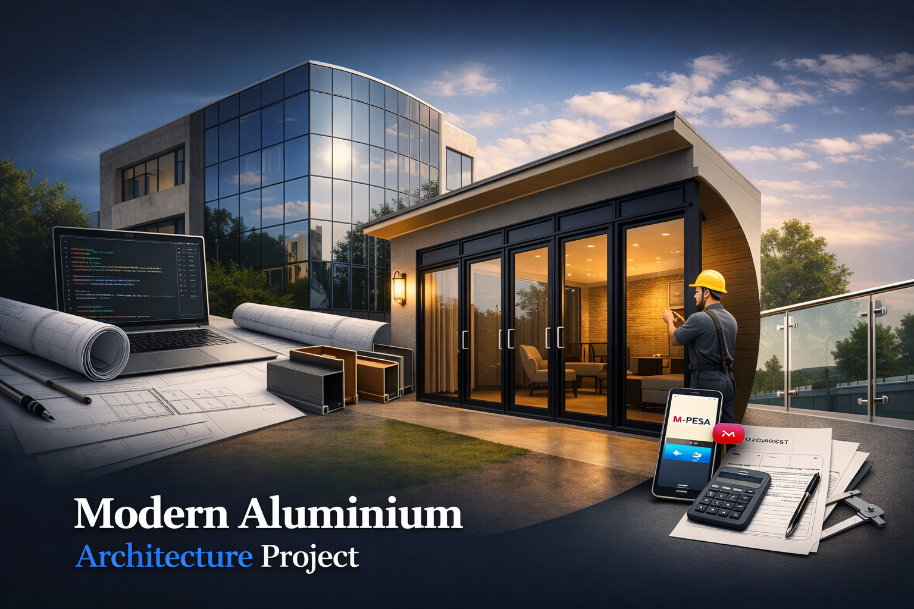

<div align="center">

# 🏬 Theolan Aluminium International Ltd
### Web Application

**Professional Aluminium Fabrication & Supply Platform**

[](https://github.com/DerrickOmwanza/Theolan_WebApp)
[](LICENSE)
[](https://nodejs.org/)
[](https://reactjs.org/)
[](https://postgresql.org/)



</div>

## 📋 Overview

**Theolan Aluminium International Ltd** is a Kenya-based aluminium fabrication and supply company specializing in custom windows, doors, curtain walls, partitions, and architectural glazing systems. This web application digitizes their entire business workflow:

- ✅ 24/7 online booking and quote requests
- ✅ Instant quote estimation
- ✅ Real-time order tracking
- ✅ M-Pesa payment integration
- ✅ Admin management dashboard
- ✅ SMS/WhatsApp notifications

## 🎯 Key Features

| Feature | Description |
|---------|-------------|
| **Booking System** | Clients can book site visits with real-time slot availability |
| **Quote Calculator** | Instant pricing estimates based on product selection and dimensions |
| **Product Gallery** | Showcases 50+ completed projects with filtering by category |
| **Order Tracking** | Real-time order status with visual timeline |
| **M-Pesa Payments** | Secure STK push payments via Safaricom Daraja API |
| **Admin Dashboard** | Complete management panel for orders, clients, and analytics |

## 🏗️ Architecture

```
┌─────────────────┐    ┌─────────────────┐    ┌─────────────────┐
│   FRONTEND      │    │    BACKEND      │    │    DATABASE     │
│                 │    │                 │    │                 │
│  ⚡ React 18    │◄──►│  🟢 Node.js     │◄──►│  🐘 PostgreSQL   │
│  ⚡ Vite        │    │  🮆 Express      │    │  📊 Knex.js     │
│  ⚡ TailwindCSS  │    │  🔐 JWT Auth     │    │                 │
│  ⚡ PWA Ready   │    │  💳 M-Pesa       │    │                 │
└─────────────────┘    └─────────────────┘    └─────────────────┘
```

## 📁 Project Structure

```
OlanAlumint.web/
├── 📄 README.md                 # This file
├── ⚙️ Procfile                    # Heroku config
├── ⚙️ docker-compose.yml          # Local dev setup
├── 📁 Docs/                      # All documentation
├── 📁 backend/                    # Node.js API
├── 📁 frontend/                   # React app
└── 📁 images/                     # Assets
```

## 🚀 Quick Start

### Prerequisites
- Node.js 18+
- PostgreSQL 14+
- Redis (optional)

### 1. Clone & Install
```bash
git clone https://github.com/DerrickOmwanza/Theolan_WebApp.git
cd Theolan_WebApp

# Backend
cd backend && npm install
cp .env.example .env

# Frontend
cd ../frontend && npm install
cp .env.example .env
```

### 2. Start Development
```bash
# Terminal 1: Backend
cd backend && npm run dev

# Terminal 2: Frontend
cd frontend && npm run dev
```

### 3. Access
- **Frontend:** http://localhost:5173
- **Backend:** http://localhost:3000
- **Health:** http://localhost:3000/health

## 🔐 Quick Login (Dev)

| Role | Phone | Password |
|------|-------|----------|
| Admin | `+254712345679` | `AdminPass123!` |
| Client | `+254712345678` | `Password123!` |

## 📦 Deployment

| Service | Platform | URL |
|---------|----------|-----|
| Frontend | Vercel | https://olanallumint.co.ke |
| Backend | Railway | https://api.olanalumint.co.ke |
| Database | Railway PostgreSQL | Managed |

See [Docs/DEPLOYMENT_GUIDE.md](Docs/DEPLOYMENT_GUIDE.md) for details.

## 📊 API Endpoints

```
POST   /api/v1/auth/signup        - Register
POST   /api/v1/auth/login         - Login
GET    /api/v1/products           - Products
GET    /api/v1/gallery            - Gallery
POST   /api/v1/bookings           - Create booking
POST   /api/v1/quote              - Get quote
```

See [Docs/04_API_CONTRACT.md](Docs/04_API_CONTRACT.md) for full spec.

## 📄 Documentation

| Document | Purpose |
|----------|---------|
| [01_SYSTEM_ANALYSIS.md](Docs/01_SYSTEM_ANALYSIS.md) | Requirements & features |
| [02_SYSTEM_ARCHITECTURE.md](Docs/02_SYSTEM_ARCHITECTURE.md) | Technical architecture |
| [03_DATABASE_SCHEMA.md](Docs/03_DATABASE_SCHEMA.md) | Database design |
| [04_API_CONTRACT.md](Docs/04_API_CONTRACT.md) | API specifications |
| [DEPLOYMENT_GUIDE.md](Docs/DEPLOYMENT_GUIDE.md) | Deployment guide |
| [SECURITY_AUDIT.md](Docs/SECURITY_AUDIT.md) | Security audit |

## 🧪 Testing

```bash
# Backend
cd backend && npm test

# Frontend
cd frontend && npm test
```

**Coverage:** 96 tests passing ✅

## 📞 Support

- Issues: GitHub Issues
- Email: security@olanallumint.co.ke
- M-Pesa: Integrated support

## 🔒 License

**Proprietary & Confidential** - © 2026 Theolan Aluminium International Ltd.

<div align="center">

**🚀 Ready for Production**

[](https://vercel.com)
[](https://railway.app)

</div>